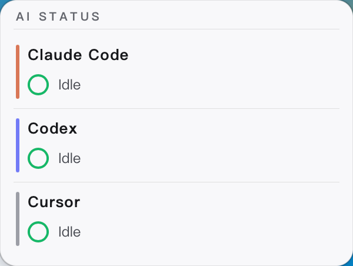
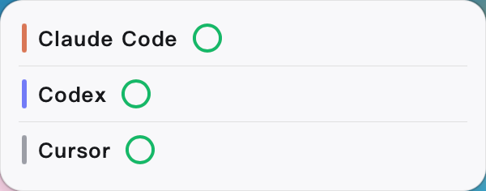
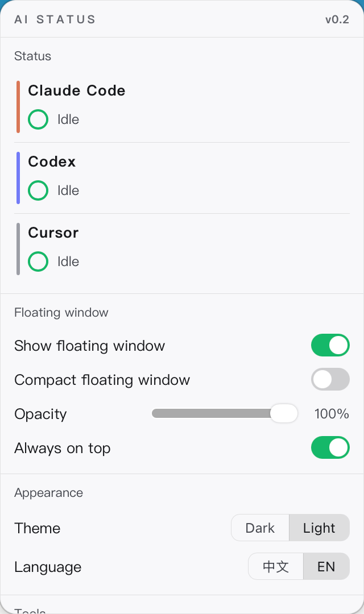

# AI STATUS

**An always-on-top desktop widget + menu-bar app that shows, at a glance, the live status of your AI coding tools — Claude Code, Codex, Cursor.**

See instantly which tool is working, which is waiting for you, which errored, and which hit its quota — no more juggling terminals and windows. Runs fully **local: no network, nothing leaves your machine.**



## Why I built it

Running several AI coding sessions at once, I kept getting distracted wondering "how much quota is left, am I about to get rate-limited?" — and constantly switching windows to guess what each tool was doing. AI STATUS is my way to stop worrying about that: it collects the run status and quota of Claude Code / Codex / Cursor into one small window, so a quick glance tells me everything and I can keep my focus on the actual work.

Down the road I also want it to **track token usage** — partly to know where my tokens go, partly to keep an eye on these AI tools so they can't quietly "black-box" my tokens.

## Features

- **Grouped by tool** — Claude Code, Codex, Cursor each get a row with a brand-colored accent bar (extensible to Trae, etc.).
- **Per-task status** — spinning green = running, yellow `?` = waiting for you, red `×` = error, green check = just finished (auto-hides after a few seconds). Multiple tasks per tool are shown separately.
- **Quota exhausted** — when the whole account hits its limit, that tool's tasks collapse into a single red clock with the countdown and reset time.
- **Network hint** — a tool's flaky/offline network is flagged separately.
- **Tokens + timer** — each task shows tokens used and elapsed time; long text auto-scrolls.
- **Compact mode** — collapse to one row per tool (name + status ring); double-click the widget to toggle.
- **Menu-bar panel** — click the menu-bar icon for status + settings (dark/light theme, language, opacity, launch at login, menu-bar progress rings, …).
- **Drag anywhere** — grab any spot to reposition; never blocks the center of the screen.
- **Bilingual UI** — English / Chinese.

## Screenshots

| Widget | Compact | Settings panel |
| :---: | :---: | :---: |
|  |  |  |

## Install

### macOS (Apple Silicon)

1. Download `AI STATUS_x.y.z_aarch64.dmg` from [Releases](../../releases).
2. Open the dmg and drag **AI STATUS** into Applications.
3. The app is unsigned, so on first launch macOS may say "damaged / unidentified developer". Clear the quarantine flag once, then open normally:

   ```bash
   xattr -cr "/Applications/AI STATUS.app"
   ```

### Windows (x64)

Windows installers (`.msi` / `-setup.exe`) are built on demand by GitHub Actions on a Windows runner: go to **Actions → release → Run workflow**; artifacts are published to Releases. Unsigned — if SmartScreen warns, click "More info → Run anyway".

> macOS can't build Windows packages locally, so they go through CI (see [.github/workflows/release.yml](.github/workflows/release.yml)). Getting rid of the first-open security prompts entirely requires Apple / Windows code-signing certificates.

## Connecting your AI tools

Tool status is reported by **local adapters** (hook / notify scripts) to `127.0.0.1:7799` (a localhost-only port). Adapters send only "tool name / project name / session id / status summary / token count" — **never your prompts, code, full logs, API keys, or environment variables.**

- **Claude Code** — register `adapters/claude-code/asb_hook.py` in the hooks section of `~/.claude/settings.json`.
- **Codex** — point `notify` in `~/.codex/config.toml` at `adapters/codex/asb_notify_chain.sh` (turn logs are polled automatically).
- **Cursor** — point `~/.cursor/hooks.json` at `adapters/cursor/asb_cursor_hook.py`.

Without hooks configured, the app also falls back to process detection (pgrep) to show whether a tool is running. To add a new tool, see [docs/detection-spec.md](docs/detection-spec.md).

## Privacy

- **Fully local**: listens only on `127.0.0.1:7799`; no network, no uploads, no telemetry.
- **Never collected**: prompt content, code content, full logs, API keys, environment variables.
- Status summaries live only in local memory and are cleared on exit.

## Roadmap

- **Standalone (current, targeting 1.0)** — aggregate the run status and quota of your AI tools on one machine.
- **2.0 hardware support** — drive a physical device to display status.
- **3.0 token insight** — track token usage per tool; using the cumulative usage at the last limit hit as a self-calibrating baseline, estimate how far / how long until the next 5h / weekly limit and warn ahead of time; aggregate across devices to compare, and keep AI tools from "black-boxing" tokens.

## Build from source

```bash
npm install
npm run tauri dev      # dev (hot reload)
npm run tauri build    # build an installer for the current platform
```

Stack: Tauri 2 + React + TypeScript (frontend) + Rust (a local HTTP service with zero network dependency).

## License

[MIT](LICENSE)
